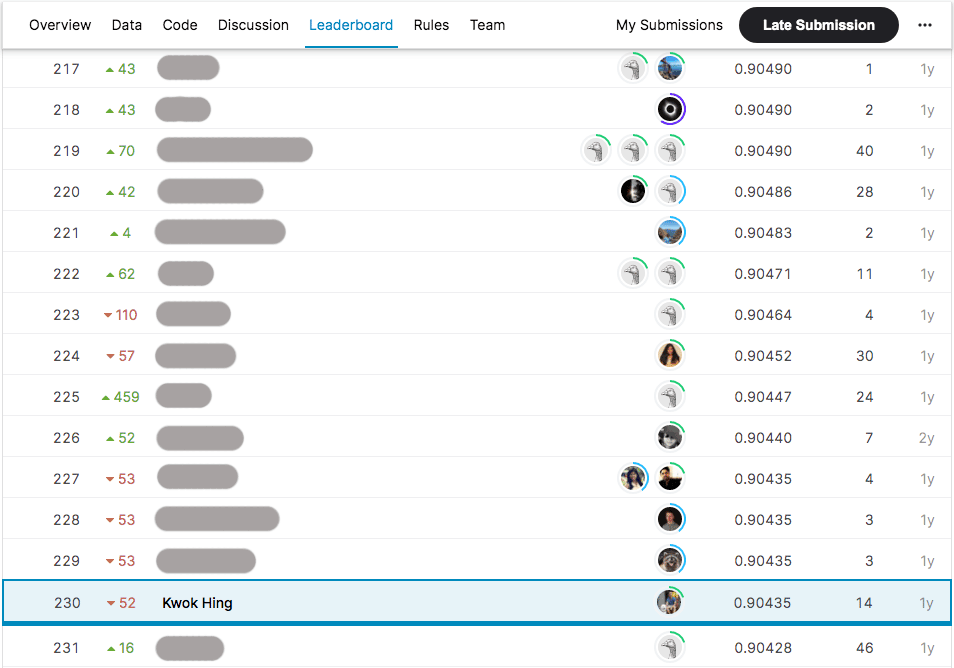

## WiDS Datathon On Predicting Patient Survival 

This repo provides the submission entry for a [kaggle dataton](https://www.kaggle.com/competitions/widsdatathon2020) to create a model that uses data from the first 24 hours of intensive care to predict patient's survival. 

There are numerous missing data in this challenge, the key to getting higher accuracy lies in (i) imputation of data, (ii) feature engineering based on domain knowledge (e.g calculating BMI, or other medical metrics), and (iii) features selection (as there are far too many features in the dataset and not all are useful). LightGBM is used to achieve an approximately 90% accuracy, I believe that any gradient boosted models with some decent work on data imputation, feature engineering and selection should provide a fairly accurate prediction model.

## Getting started
Open `WiDS_Patient_Survival.ipynb` on a jupyter notebook environment. Alternatively, you can view the codes in Google Colab . The notebook consists of further technical details.

## Improvements
Could potentially explore the use of Deep Learning Techniques.
